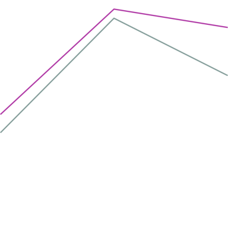

# VLMs are not blind ?

This repository contains experiments testing **Qwen2-VL-Instruct** in **vision-only mode**.
The model receives only an image as input (and an empty text prompt).  
Fine-tuning is performed using **LoRA** adapters.

---

## LoRA Configuration

| Parameter | Value |
|------------|--------|
| `r` | 16 |
| `alpha` | 64 |
| `dropout` | 0.3 |
| LoRA layers | `attn.qkv`, `attn.proj`, `q_proj`, `v_proj`, `mlp.fc1`, `mlp.fc2` |
| Learning rate | 1e-4 |
| Batch size | 4 |
| Epochs | 50 |
| Checkpoint selection | lowest training loss |
---

## Results

| Train size (Green/Yellow lines) | Paper subset | Green/Yellow lines | Random colors | Random colors (grid=24) | Random colors (width=6) |
|---------------------------------|--------------|--------------------|----------------|--------------------------|--------------------------|
| 10                              | 48.8 ± 1.0 | 50.3 ± 0.9 | 51.4 ± 2.5 | 43.9 ± 1.6 | 46.2 ± 2.1 |
| 20                              | 68.0 ± 5.2 | 72.1 ± 6.1 | 72.7 ± 6.8 | 70.4 ± 4.2 | 65.1 ± 7.3 |
| 50                              | 84.8 ± 7.1 | 87.1 ± 5.8 | 75.9 ± 9.2 | 78.6 ± 10.4 | 81.2 ± 6.0 |
| 100                             | 86.4 ± 2.0 | 91.0 ± 1.2 | 83.7 ± 3.5 | 77.3 ± 6.2 | 79.8 ± 6.9 |
| 300                             | 99.1 ± 0.7 | 99.2 ± 0.5 | 99.3 ± 0.6 | 97.3 ± 2.8 | 97.8 ± 1.8 |


**Figure:** F1 score as a function of the number of training samples used for LoRA fine-tuning.  


## Data

|                                        Train set                                        |                 Paper subset                 |                                       Green/Yellow lines                                       |                                       Random colors                                        |                                   Random colors (grid=24)                                   |                                   Random colors (width=6)                                   |
|:---------------------------------------------------------------------------------------:|:--------------------------------------------:|:----------------------------------------------------------------------------------------------:|:------------------------------------------------------------------------------------------:|:-------------------------------------------------------------------------------------------:|:-------------------------------------------------------------------------------------------:|
|  |  |  |  |  |  |


The dataset is generated using `2dline.ipynb`, adapted from the [Vision-Language Models Are Blind repository](https://github.com/anguyen8/vision-llms-are-blind/tree/main/src/LineIntersection).

The training set is produced with the same parameters as in the original paper, **except for the line colors**, the lines are **green and yellow**.  
We keep only images with **dpi = 100** from the generated training data.

To evaluate generalization, we use several test variants:

- **Paper subset** - the exact subset used in the original paper (3,600 samples).  
- **Green/Yellow lines** - same geometry as the paper subset, but red/blue lines replaced with green/yellow (matches the train set distribution).  
- **Random colors** - each line assigned a random color.  
- **Random colors (grid=24)** - random colors, generated on a finer 24×24 grid.  
- **Random colors (width=6)** - random colors with thicker (width = 6) lines.

Each test variant contains **300 random images**, except for the *Paper subset*.
## Download data


The datasets used in this project can be downloaded from Google Drive (or generated locally running `2dline.ipynb`):

[Download dataset (Google Drive)](https://drive.google.com/file/d/1QeLtP6ouXlXjP6rLMsZ0H5DFJ7e1tTMI/view?usp=drive_link)

They should be placed in the `./data/` directory after extraction.

## Repo structure
```
vlms_are_not_blind/
├─ script_lines0.py       # Script to run fine-tuning and evaluation for lines intersection
├─ train_sft.py           # LoRA fine-tuning for Qwen2-VL
├─ 2dline.ipynb           # data generation (Lines intersection) from https://vlmsareblind.github.io/#task1
└─ src/
   ├─ data.py             # dataset loading
   ├─ model.py            # model loading + LoRA setup
   ├─ seed.py             # set random seeds
   └─ utils.py            # parsing + metrics helpers
```

---

## Installation

We used a machine with two NVIDIA GeForce RTX 4090. 

```bash
# Python 3.10+ recommended
# Create a new conda env
conda create -n vlm_not_blind python=3.10 -y
conda activate vlm_not_blind

# Install dependencies
pip install -r requirements.txt

```

---
## Train VLM adapters (LoRA)

`train_sft.py` fine-tunes **~12.7M** LoRA parameters.  

We recommend installing flash attention for this part:
```bash
pip install -U flash-attn --no-build-isolation
```

**Minimal run (Qwen2-VL-2B)**
```bash
python train_sft.py \
  --model_id Qwen/Qwen2-VL-2B-Instruct \
  --dataset_name linesdetailed \
  --epochs 50 \
  --batch_size 4 \
  --lora_r 16 \
  --lora_alpha 64 \
  --lora_dropout 0.3 \
  --lr 1e-4 \
  --seed 42 \
  --num_workers 8 \
  --user_system_message "" \
  --user_query_message "" \
  --train_size 300 \
  --test_size 300 \
  --test_subset_size 300 \
  --use_wandb
```

**Notes**
- Checkpoints are written to a temporary `./ckpt_<RUNID>` during training.
- By default, the script cleans up the checkpoint directory at the end (adjust if you want to persist).

---
